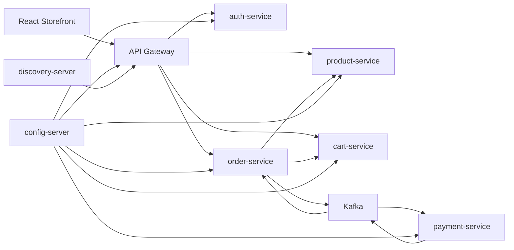
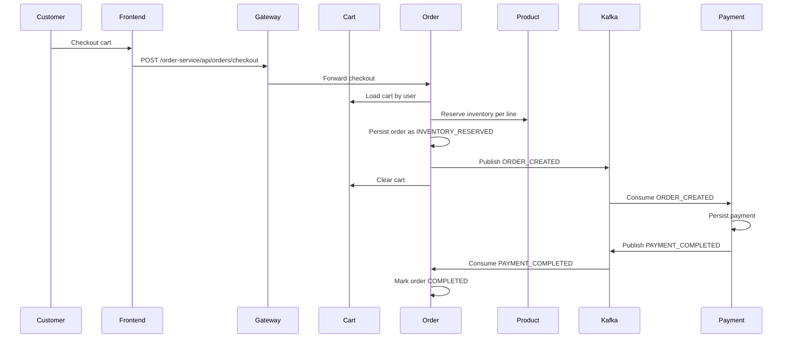

# Architecture

## Runtime View

## Checkout Sequence

## Service Boundaries

- Product owns catalog identity, price, active status, and inventory.
- Cart owns a user's intent to buy and stores price/product snapshots for UX.
- Order owns checkout, reservation, order totals, and order lifecycle.
- Payment owns payment records and emits payment result events.
- Auth owns customer identity and signed bearer tokens.

## Remaining Production Enhancements

- Replace H2 with PostgreSQL per service and Flyway migrations.
- Add Testcontainers for Kafka and database integration tests.
- Move token validation to the gateway or a shared auth filter.
- Add Prometheus/Grafana dashboards and distributed tracing.
- Implement a transactional outbox for event publishing.
